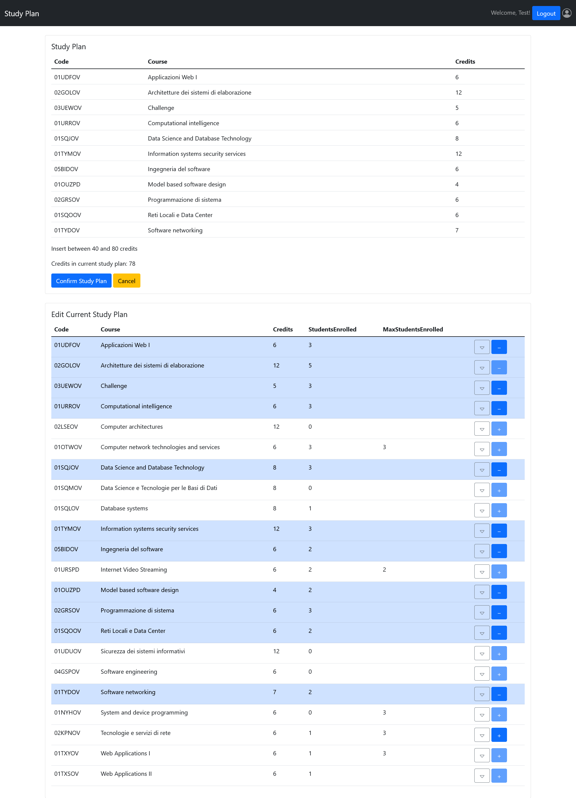

# Exam #1: "Piano degli Studi"
## Student: s281221 Pepe Manuel 

## React Client Application Routes

- Route `/`: home page with the list of available courses
- Route `/login`: login page
- Route `/edit`: study plan editing page
- Route `*`: default "Page not found" page 

## API Server

- GET `/api/sessions/current`
  - Description: checks whether the user is logged in or not
  - Request body: _None_
  - Response:
    - `200 OK` (success)
    - `401 Unauthorized User` (user not logged in)
  - Response body: _None_

- POST `/api/sessions`
  - Description: authenticate the user who is trying to login
  - Request body: credentials of the user who is trying to login
    ```json
    {
      "username": "test@polito.it",
      "password": "password"
    }
    ```
  - Response: 
    - `200 OK` (success)
    - `401 Unauthorized User` (user not logged in)
  - Response body: authenticated user
    ```json
    {
        "id":1,
        "username":"test@polito.it",
        "name":"Test",
        "isFullTime":1
    }
    ```

- DELETE `/api/sessions/current`
  - Description: logs out current user
  - Request body: `None`
  - Response:
    - `200 OK` (success)
    - `401 Unauthorized User` (user not logged in)
  - Response body: `None`

- GET `/api/courses`
  - Description: returns all courses
  - Request body: `None`
  - Response: 

    - `200 OK` (success) 
    - `500 Internal Server Error` (generic error)
  - Response body: an array of objects, each one describing a course
    ```json
    [{
        "code":"01UDFOV",
        "name":"Applicazioni Web I",
        "credits":6,
        "propedeuticcourse":null,
        "maxstudentsenrolled":null,
        "studentsenrolled":1
    },{
        "code":"02GOLOV",
        "name":"Architetture dei sistemi di elaborazione",
        "credits":12,
        "propedeuticcourse":null,
        "maxstudentsenrolled":null,
        "studentsenrolled":1
    } ... ]
    ```

- GET `/api/incompatibilities`
  - Description: returns the incompatibilities between exams
  - Request Body: _None_
  - Response: 
    - `200 OK` (success)
    - `500 Internal Server Error` (generic error)

  - Response body: an array of objects, each one describing the relationship "coursea is conompatible with courseb, and viceversa"

    ```json
    [{
        "coursea":"01NYHOV",
        "courseb":"02GRSOV"
    },{
        "coursea":"01OTWOV",
        "courseb":"02KPNOV"
    }, ... ]
    ```

- GET `/api/studyplan`

  - Description: returns the study plan for the current user.
  - Request body: `None`
  - Response:

    - `200 OK` (success)
    - `401 Unauthorized User` (user not logged in)
    - `404 Not Found`
    - `500 Internal Server Error` (generic error)
  - Response body: an array of all course codes in the study plan for the current user.
    ```json
    [{
        "course": "01OTWOV"
    }, {
        "course": "01SQMOV"
    }, {
        "course": "01UDFOV"
    }, ... ]
    ```

- POST `/api/studyplan`

  - Description: adds the study plan for the current user.

  - Request body: the courses to be added to the study plan

    ```json
    [{
      "code": "01UDFOV",
      "name": "Applicazioni Web I ",
      "credits": 6
    }, {
      "code": "02GOLOV",
      "name": "Architetture dei sistemi di elaborazione",
      "credits": 12
    }, ... ]
    ```

  - Response:

    - `201 Created` (success)
    - `401 Unauthorized User` (user not logged in)
    - `422 Unprocessable Entity` (values do not satisfy validators)
    - `503 Internal Server Error` (generic error)

  - Response body: `None`

- DELETE`/api/studyplan`

  - Description: deletes the study plan for the current user
  - Request body: `None`
  - Response:
    - `204 No Content` (success)
    - `503 Service Unavailable` (generic error)
  - Response body: `None`

- PUT `api/studyplan/enrollment`
  - Description: updates the type of enrollment of the current user
  - Request body: enrollment type (`0` for part-time, `1` for full-time)
    ```json
    {
      "enrollment": 1
    }
    ```
  - Response:
    - `204 No Content` (success)
    - `401 Unauthorized User` (user not logged in)
    - `422 Unprocessable Entity` (values do not satisfy validators)
    - `503 Service Unavailable` (generic error)
  - Response body: `None`


## Database Tables

- Table `users`
  - contains <u>id</u>(key), name, email (unique), password, salt, isFullTime (0-1)
  - stores the informations about the user, such as name, email, password hashed, salt and kind of enrollment
- Table `studyplans` 
  - contains <u>userid</u> (foreign key), <u>course</u> (foreign key)
  - stores the informations about the studyplan as a list of tuples (userid, course)
- Table `courses` 
  - contains <u>code</u>, name, credits, propedeuticcourse, maxstudentsenrolled
  - stores all the informations about the courses
- Table `incompatibilities` 
  - contains <u>coursea</u> (foreign key), <u>courseb</u> (foreign key), with coursea > courseb
  - stores the incompatibility between two courses as a tuple (coursea, courseb)

## Main React Components

- `CoursesTable` (in `CourseComponents.js`): table rendering all the courses available, with the possibility to be expanded to show propedeutic and incompatible courses
- `LoginForm` (in `LoginComponents.js`): form to log in
- `StudyPlanTable` (in `StudyPlanComponents.js`): table rendering all the courses in current study plan

## Screenshot



## Users Credentials

- username: `test@polito.it`, password: `password`. Default user to test web app functionalities
- username: `manuel.pepe@polito.it`, password: `pwd123`. Part-time student
- username: `andrea.neri@polito.it`, password: `4ndr34n3r1`. Full-time student
- username: `mario.rossi@polito.it`, password: `m4r10r0ss1`. Part-time student
- username: `paola.verdi@polito.it`, password: `hwrg27@!`. Full-time student
